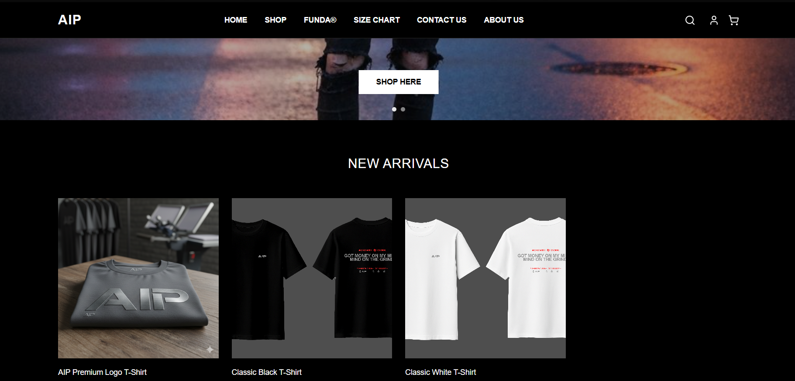

  
  
  

  
  
  

## Preview

  

# AnythingIsPossible 🎉

Providing a platform that promotes items that may not be well-recognized within the
campus. It also allows students to easily find products available from other students on
campus. Additionally, the application ensures that buyers can verify the legitimacy of the
items through setting up meet-ups within the school premises, creating a safer and more trustworthy buying experience. This solution directly addresses the visibility and sales challenges for student entrepreneurs, while offering
convenience and security for buyers.

---

🚀 GET STARTED

- Fetch the Files towards your local directory
    `git pull`
- Install the dependencies
    `npm install`
- Run the Project
    `npm run dev`

---
🏷️ Requirements
- Node.js
- Visual Studio Code
- npm or yarn
---

🚧 Project Status
**Status: Incomplete**

This project is currently under development. Contributions, bug reports, and suggestions are appreciated.

---

🧑‍💻 Contributors:
- [Your Name Here]
